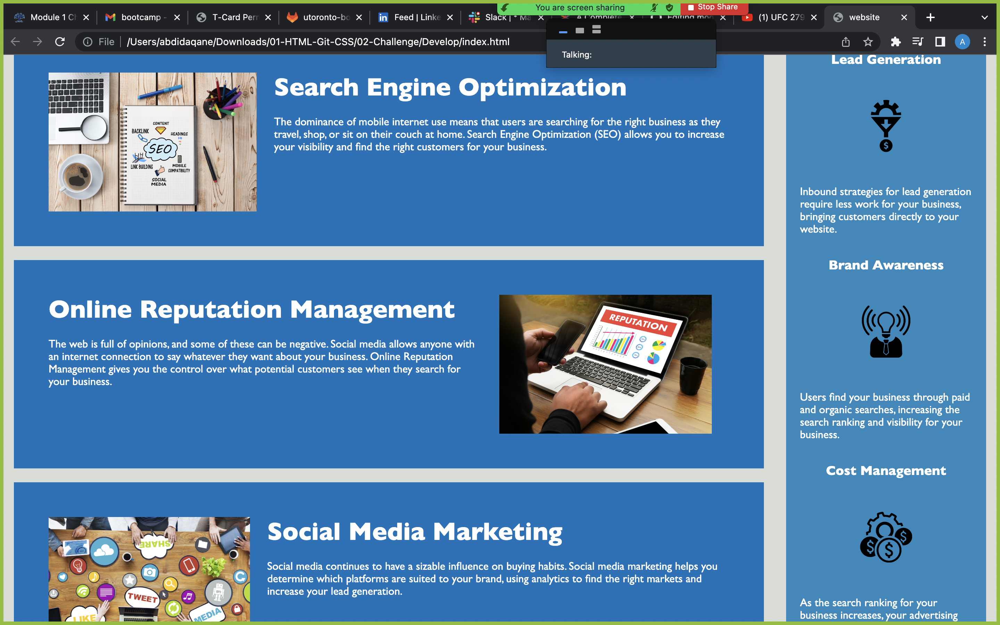

# module01challenge
My motivation for this particular project was to simplify the coding and to make it easy to read for another person.
The reason i built this project was to see potential mistakes and redundancy because for a first time coder its mistakes i could make too.
The problems it solves is to make the code clear and understandable for another devleoper to read and understand.
I learned to take my time because one slio up in coding could mean the entire code is useless.

